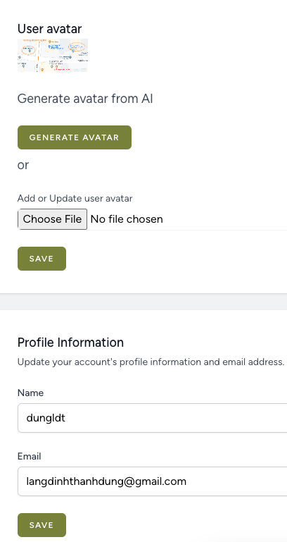

# Laravel & OpenAI generate avatar

## Demo


## Setup
* Create a database locally named `laravel` utf8_general_ci 
* Download composer https://getcomposer.org/download/
* Rename `.env.example` file to `.env` inside your project root and fill the database information.
* Run `composer install` or ```php composer.phar install```
* Run `php artisan key:generate` 
* Run `php artisan migrate`
* Run `php artisan serve`

## Features
* Register user
* Login user
* Login with github account
* Edit profile
* Change avatar by uploading an image
* Change avatar by generating (AI generate)

## Requirements
* PHP v8.1+
* Laravel 10+
* OpenAI API (Register account and generate secret key)
* MySQL

## Contact me
* email: langdinhthanhdung@gmail.com
